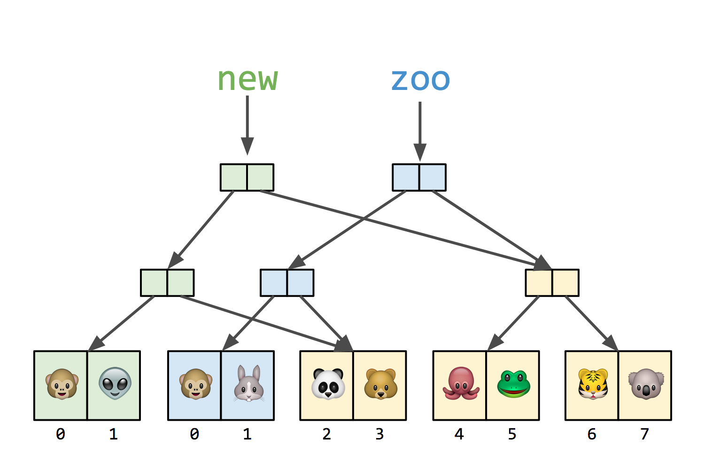

# Frontend Master Functional Javascript First Step

## What is Functional Programming?

One of the things we might know about functional programming is that it's a
style of writing code or a type of programming that some languages support.

Another way to understand functional programming, other than thinking of it as
style of writing code, is as a programming paradigm where paradigm can be
thought of as a worldview or a mindset or a way of understanding something.

There are a lot of programming paradigms that software developers have
developed over the course of computing history. Here's a few list of
programming paradigms:
- Imperative.
- Declarative.
- Object-oriented.
- Functional.

We can think of **imperative programming** as **understanding the world of
computing as a series of commands**. A programs are a series of instructions
that software developer gives to the computer.

One of the sub-paradigm of imperative mindset is object-oriented programming.

To make things simple, in object-oriented programming we use concepts like
encapsulation where we have objects that keep internal values to themselves,
and they can change those values which when we have values changing over time
we have something called *state*. And then, those objects, since they're
encapsulated, they keep that to themselves but they can talk to each other
through messages that they pass, for example, by calling methods on other
objects in the program.

We can think of **declarative programming** as **declare what we want from
the computer and let the computer figure out how it's going to do that**.

One of the sub-paradigm of declarative mindset is functional programming.

To make things simple, functional programming boils down to single thing,
**pure functions**. Pure functions means a function but it's special in that
it only takes its input in and that is the only data that it looks at, and all
it does is return its output.

What is not allowed in pure function is, any time the function has any
relation to the outside world other than through its input and its return
value (which is called *side effect*).

> The only information the function needs is whatever is passed into it as an
> input, and the only thing it does in the world is return its output value.

## Pure Vs Impure Function

Here's an example of impure function:
```javascript
let name = 'Eren';

function greet() {
  console.log(`hello, ${name}!`);
}

greet();

name = 'Kirito';
greet();
```

Here's an example of pure function:
```javascript
function greet(name) {
  return `hello, ${name}!`;
}

greet('Eren');
greet('Alan');
```

In the impure function, the side effect is that if the function was called at
al later time when the variable changes, we might have an unexpected output.

In the pure function, we have an expected output. We passed it with one
argument and it's gonna return a value based on the argument.

> The result of the pure function only depends on the arguments that are
> passed in.
>
> Pure function is *deterministic* which means it's output is totally
> determined by its inputs.

Keep in mind that **logging or updating the world in any way other than
returning a value**, that is a violation of what we set up here as pure
function is.

## Why Functional Programming?

When functions are deterministic, when we know exactly what output we gonna
get given what input, we get code that's much more predictable.

That means, it's also much easier to test, to debug, and to find places where
there are problems, because if we've ever tested a function that's not pure,
we might need to do a complicated setup to kind of mock out the state of the
world because the state of the world matters for how the programs runs.

Whereas with functional program, which is going to boil down to pure function,
all we need to provide to test our function is a test input. For example, give
it a string, see if it gives us the right string back. That makes it much
easier to test our code, to maintain our code, and to think about interaction
between different parts of our program because each function become kind of
these isolated pure deterministic units.

A good rule of thumb is **each function should do only one thing**.

## Guiding Principles of Functional Programming

### Do Everything with Functions

Basically it means that our program becomes a function.

Instead of thinking "How should my program run?", we should be thinking
"What should my program take in? And what should my program output?".

Here's an example of imperative code:
```javascript
let name = 'Eren';
let greeting = 'hi';

console.log(`${greeting}, ${name}!`):

greeting = 'howdy';
console.log(`${greeting}, ${name}!`);
```

And here's an example of functional code:
```javascript
function greet(greeting, name) {
  return `${greeting}, ${name}!`;
}

greet('hi', 'Eren');
greet('howdy', 'Eren');
```

### Avoid Side Effects

**Only return output, do nothing else. Only look at input, do nothing else**.

This is some code that has side effects:
```javascript
let thesis = { name: 'church', date: 1969 };

function renameThesis(newName) {
  thesis.name = newName;
  console.log('renamed');
}

renameThesis('chruch-turing');
thesis;
```

And here's a refactor version of the program without side effects:
```javascript
const thesis = { name: 'church', date: 1969 };

function renameThesis(oldThesis, newName) {
  return {
    ...oldThesis,
    name: newName,
  };
}

const thesis2 = renameThesis(thesis, 'chruch-turing');
thesis;
thesis2;
```

Now, instead of updating the global `thesis` object, we're creating a new
object.

**When we work with functional programs, we don't want to update things in
place, we want to take the old thing and make a new slightly different copy
of it that we can return out**.

So when we say things like "data transformation", perhaps that's a misnomer
because we're not really changing the data, we're just taking some data and
returning new data based on the original data.

## Recursion

There are two kind of looping, iteration and recursion. We could
think of it as "imperative programming for iteration" and "functional
programming for recursion".

With iteration, we think about repetition in terms of loops with `for` or
`while` usually. As we go with the loop, we're probably going to be changing
some variable, like a counter `i`. So that means we have value that changing
over time, which means that it's stateful.

With recursion, instead of using `for` and `while` and the stateful loop,
we're going to use self-reference. We're gonna have a function call itself
from within itself. Now, what that means is that each call of function, all
we need to pay attention to is the input coming in and the output coming out.

> The idea with recursion is that we're no longer changing those values over
> time. We're getting rid of that state. We've got a more stateless way of
> repeating the code that we need to repeat.

Below is an example of iteration code:
```javascript
function sum(numbers) {
  let total = 0;
  for (i = 0; i < numbers.length; i++) {
    total += numbers[i];
  }

  return total;
}

sum([0, 1, 2, 3, 4]);
```

Now, let's make that iteration into recursion like this:
```javascript
function sum(numbers) {
  if (numbers.length === 1) {
    // base case
    return numbers[0];
  } else {
    // recursive case
    return numbers[0] + sum(numbers.slice(1));
  }
}

sum([0, 1, 2, 3, 4]);
```

In practice, when we're writing recursive functions, we have to make sure that
we have two parts of the function. The recursive part and the non-recursive
part.

Be careful about performance with recursion. Because recursion calling the
function itself over and over again, it can be **an expensive operation when
dealing with large input**.

## First Class Functions

We can say that a language has first class functions when the language support
functions being passed around as values, just like strings or numbers.

If we ever used a callback function as an argument to another function, that's
an example of first class functions use case.

## Higher Order Functions

Higher order function is a function that takes in another function, or
multiple functions, or returns a new function.

So, a higher order functions is a function that takes other functions as
input or output.

## Filter, Map, and Reduce

Here's the illustration of filter, map, and reduce to make it easier to
understand:<br>


Basically, `Array.filter()` and `Array.map()` function takes an array as
input and return a new array as output. Meanwhile, `Array.reduce()` function
takes an array as input and return a single value as output, which means all
the value of the array will be combined into some kind of accumulated array.

## Closure

Within the body of a function, we can define another function. And because of
the body of a function has its own scope, when we define and inner function,
that inner function has access to the outer/parent function scope.

Here's a simple example:
```javascript
function makeAdjectifier(adj) {
  return function (noun) {
    return adj + " " + noun;
  };
}

const coolify = makeAdjectifier('cool');
coolify('workshop');
coolify('drink');
```

So, what closure let us do? Closure let us takes multiple arguments and
kind of **lock in some of the values**, or another way to put it is
*partially apply a function*.

### Currying

There's a related concept in functional programming called *currying*.

Currying is the process of taking a function that takes in multiple values
as its input arguments and breaking up into a series of single argument
functions, which successively remember the outer scope so that we can apply
each of those multiple arguments to create more reusable functions.

## Function Composition

As we know before, functional programming is programming with pure functions
and everything in a functional program is function. So we could say it's
function all the way down.

A program in the functional programming mindset becomes a function that takes
in some kind of input and returns some kind of output. That function itself
maybe made up by a lot of simple functions that when we put them all together,
give us a complex operation worthy of a complete computer program.

The idea with functional programming is that, **we have inputs coming in, we
have outputs coming out, and those outputs can also become new inputs for the
next function whose outputs can become new inputs for another function**.

Once we figure that out, we can actually use something called **function
composition** where we putting functions together to take simple functions
and create complex program that nevertheless are input-output functions.

Here's an example of function composition:
```javascript
function ender(ending) {
  return function (input) {
    return input + ending;
  };
}

const adore = ender(' rocks');
const announce = ender(', you all');
const exclaim = ender('!');

function hyperup(x) {
  return exclaim(announce(adore(x)));
}

console.log(hyperup('vim script'));
```

## Immutability

We saw that changing things especially changing things out in the world feels
not functional, feels like side effect.

So, let's take a look at how we think about immutability when we are doing
functional programming, particularly in javascript.

> Avoid mutability for happier programming.

Instead of change in-place, do replace. Here's an example, instead of doing
this:
```javascript
let cities = ['jakarta, surabaya, jogja'];

cities[2] = 'solo';

console.log(cities); // ['jakarta', 'surabaya', 'solo']
```

We can do something like this:
```javascript
const cities = ['jakarta, surabaya, jogja'];

const newCities = cities.map((city) => {
  if (city === 'jogja') return 'solo';
  return city;
});

console.log(cities); // ['jakarta, surabaya, jogja']
console.log(newCities); // ['jakarta', 'surabaya', 'solo']
```

Now, we might be wondering, "Copying data isn't very efficient, right?
Overtime, isn't that gonna a lot of memory and can potentially decrease
performance?".

There's a solution for that in functional programming world which is a special
types of data structures that are designed to be immutable but also efficient.

This are called **immutable data structures** or persistent data structures.

### Immutable Data Structures

Immutable data structures allow us to represent our data in some kind of
tree-like structure so that we can reuse unchanged parts of the tree while
changing the parts that we wanna update.

Here's an example of immutable data structure:


In the example above, instead of copy the whole array, we break down the array
into a tree-like structure and only copy the node of the tree that we need to
change.

> This course didn't explain more details about immutable data structure.
> Watch the youtube video in the reference section below.

## Q&A

- Does this means calling a function within another function makes it impure
function?

> Whether or not the function that calls another function is pure, depends on
> the purity of the function it was calling. If we know that the inner
> function is pure and we're basically delegating some computation to it, then
> that doesn't necessarily mean that we've got an impure function.

- In pure function, if it's not allowed to do anything in the world except
return its output value, doesn't that mean the function didn't do anything?
How do we do anything in functional programming?

> This is the big "gotcha" of functional programming. When we're doing
> functional programming, we are concerned with the kind of computational
> aspect of our programs. What functional programmers do to be able to be
> productive and to be able to actually affect the world is to **take all
> those side effects (all those logs, database transactions, and
> inputs/outputs from outside world) and essentially push them to the outside
> of the program so that they're, kind of, the very last step in doing any of
> this**.

- Does a pure function need to take only one argument?

> No, functions can take multiple arguments.

- If we assign a default value to one of the function parameters, so that if
we don't passed in the argument for those function parameters, by default it
will use the default value. Does that make the function no longer a pure
function?

> A pure function changes nothing about the world other than returning its
> value. If we passed in the default value, does the function change anything
> about the world? If yes, the function become impure. If no, the function
> still a pure function.
>
> The other thing that we know about pure function is they are deterministic.
> If we call it with the same arguments, we always gonna get the same result.
>
> Now, if we have a default value, and then forget to give an arguments, do we
> always going to get the same result? On the surface, we might think, yes.
> The "gotcha" there is that javascript, unlike in some functional languages,
> we have objects that are mutable, meaning we can change something about
> object elsewhere in our program. In that case, we might get different output
> if the value of the object changed between calls.

- During our recursive function execution and during recursive calls, we're
updating something in the outside world like a database, does that make it
an impure function?

> Yes. We can use recursion to help us avoid state within those functions in
> iterative loops. But, we still don't want to introduce non-deterministic or
> side effects into our code, even if it's recursive.

- Is `Array.map()` and `Array.filter()` function mutate the array?

> `Array.map()` and `Array.filter()` will produce a new array instead of
> mutating the input array.

## References

- [Code course and notes (observable)](https://observablehq.com/collection/@anjana/functional-javascript-first-steps).
- [The instructors youtube video about object-oriented programming](https://www.youtube.com/watch?v=TbP2B1ijWr8).
- [An Introduction to Functional Programming Article](https://codewords.recurse.com/issues/one/an-introduction-to-functional-programming).
- [The lambda calculus youtube video](https://youtu.be/qTHGmVrOGZo).
- [Immutable data structure youtube video](https://youtu.be/n5REbbvRYqQ).
